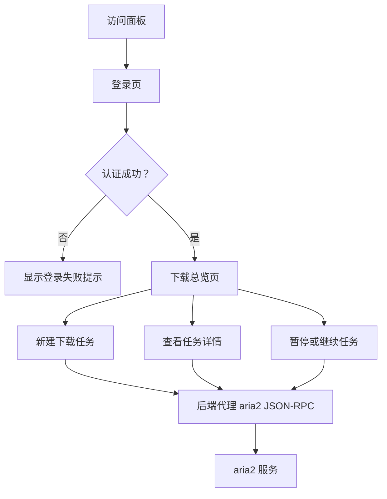

## 1. 产品概述
Aria2MX 是一个带认证功能的 aria2 Web 面板，面向个人服务器、NAS、轻量 VPS 的下载管理场景。
- 主要解决 aria2 原生 JSON-RPC 不易直接暴露、缺少账户登录和现代化管理界面的问题。
- 目标是以接近单二进制的方式部署，提供参考 AriaNg 的核心下载、任务、文件和设置管理能力。

## 2. 核心功能

### 2.1 用户角色
| 角色 | 注册方式 | 核心权限 |
|------|----------|----------|
| 管理员 | 首次启动通过环境变量或配置文件初始化 | 登录面板、管理 aria2 连接、创建和控制下载任务、查看全局状态 |

### 2.2 功能模块
1. **登录页**：账号密码登录、会话保持、错误提示。
2. **下载总览页**：任务统计、全局速度、任务列表、任务筛选。
3. **新建任务页**：URL、磁力链接、种子文件、下载目录、并发和拆分参数。
4. **任务详情页**：下载进度、连接信息、文件列表、BT peer 与 tracker 信息。
5. **设置页**：aria2 RPC 连接、RPC Secret、常用下载参数、面板账户密码修改。

### 2.3 页面详情
| 页面名称 | 模块名称 | 功能描述 |
|----------|----------|----------|
| 登录页 | 认证表单 | 输入用户名和密码，登录成功后进入下载总览页 |
| 登录页 | 安全反馈 | 登录失败时显示用户可理解的错误，不暴露内部原因 |
| 下载总览页 | 状态栏 | 显示下载速度、上传速度、活动任务数、等待任务数、已完成任务数 |
| 下载总览页 | 任务列表 | 按活动、等待、暂停、完成、错误分类展示任务 |
| 下载总览页 | 快捷操作 | 支持暂停、继续、删除、重新开始、复制 GID |
| 新建任务页 | 链接任务 | 支持多行 URL 和磁力链接批量提交 |
| 新建任务页 | 种子任务 | 支持上传 `.torrent` 文件并提交到 aria2 |
| 新建任务页 | 高级选项 | 支持下载目录、文件名、连接数、分片数、header 等常用参数 |
| 任务详情页 | 基础信息 | 展示名称、GID、状态、大小、进度、剩余时间、速度 |
| 任务详情页 | 文件列表 | 展示文件路径、大小、选择状态和完成进度 |
| 任务详情页 | BT 信息 | 展示 peer、tracker、做种状态和分享率等信息 |
| 设置页 | RPC 设置 | 配置 aria2 RPC 地址、Secret、连接测试 |
| 设置页 | 面板设置 | 修改管理员密码、会话过期时间、默认刷新频率 |

## 3. 核心流程
用户启动 Aria2MX 后，通过浏览器访问面板并登录。登录成功后，面板通过后端代理访问 aria2 JSON-RPC，避免浏览器直接持有 RPC Secret。用户可以查看任务、创建任务、控制任务状态，并在设置页维护 aria2 连接和面板账户。

## 4. 用户界面设计

### 4.1 设计风格
- 主色：近黑蓝 `#071018`，高亮青绿 `#66f0d4`，状态橙 `#ffb86b`，错误红 `#ff6b7a`。
- 按钮：轻玻璃拟态、极简圆角、低饱和描边，关键操作使用高亮边框。
- 字体：界面优先使用系统可用的现代无衬线字体，数字区域使用等宽字体以提升速度和大小信息可读性。
- 布局：桌面优先，100vh 固定布局，左侧导航、顶部状态栏、主内容区分栏；避免全局滚动，内部面板滚动。
- 图标：使用线性图标风格，避免装饰性表情符号。

### 4.2 页面设计概览
| 页面名称 | 模块名称 | UI 元素 |
|----------|----------|---------|
| 登录页 | 认证表单 | 居中玻璃卡片、背景微弱网格、输入框焦点光晕 |
| 下载总览页 | 状态栏 | 大号速度数字、紧凑统计卡片、实时刷新反馈 |
| 下载总览页 | 任务列表 | 分组标签、进度条、状态色点、悬浮操作条 |
| 新建任务页 | 创建表单 | 左侧输入区、右侧高级参数区、提交前摘要 |
| 任务详情页 | 信息面板 | 顶部进度概览、下方文件和连接信息标签页 |
| 设置页 | 配置表单 | 分组卡片、连接测试结果、敏感字段默认隐藏 |

### 4.3 响应式
桌面优先；窄屏下折叠侧边栏，任务列表切换为卡片式展示。移动端保持可用，但首要体验针对桌面浏览器和服务器管理场景。
