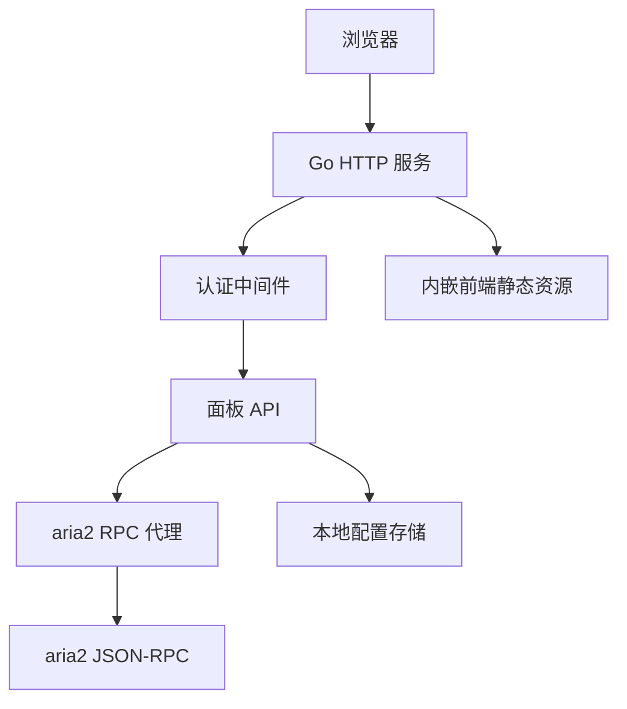
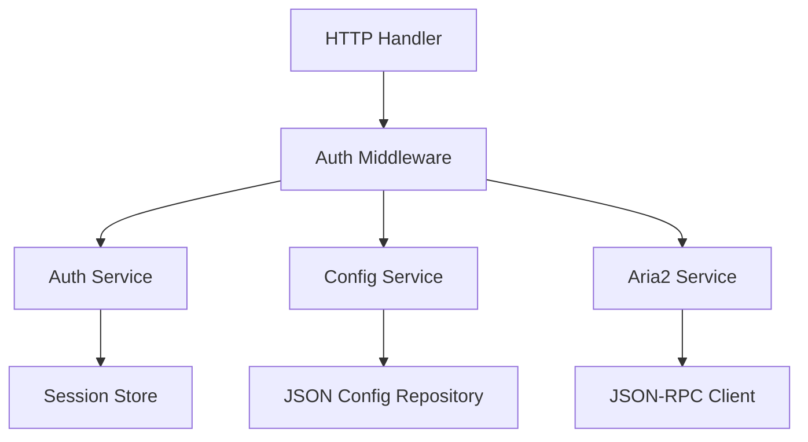
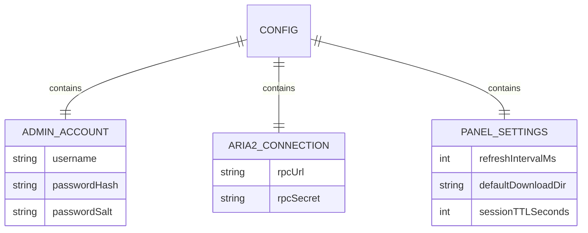

## 1. 架构设计
AriaMX 采用 Go 单进程服务：后端负责认证、配置、静态资源托管和 aria2 JSON-RPC 代理；前端构建产物通过 `embed` 打入 Go 二进制，发布时主要交付一个可执行文件。



## 2. 技术说明
- 后端：Go 1.22+ 标准库优先，`net/http`、`embed`、`crypto`、`encoding/json`。
- 前端：Vue 3 + TypeScript + Vite，构建后由 Go `embed` 内嵌。
- 样式：纯 CSS 变量与组件样式，优先保持轻量，不引入重型 UI 框架。
- 认证：服务端 Cookie Session，密码哈希存储，默认禁止未认证访问 API。
- aria2 通信：后端代理 JSON-RPC，浏览器不直接保存或发送 aria2 RPC Secret。
- 存储：本地 JSON 配置文件，保存管理员账户哈希、aria2 RPC 地址、默认下载参数等。
- 发布：`go build` 生成单个二进制；前端源码只用于开发，发布包可不包含源码目录。

## 3. 路由定义
| 路由 | 用途 |
|------|------|
| `/` | 前端应用入口 |
| `/login` | 前端登录页 |
| `/api/auth/login` | 登录并创建会话 |
| `/api/auth/logout` | 退出并清理会话 |
| `/api/auth/me` | 获取当前登录状态 |
| `/api/config` | 读取面板和 aria2 连接配置 |
| `/api/config` | 更新面板和 aria2 连接配置 |
| `/api/aria2/call` | 受控代理 aria2 JSON-RPC 调用 |
| `/api/aria2/upload-torrent` | 上传种子文件并创建任务 |
| `/assets/*` | 前端构建资源 |

## 4. API 定义

```ts
type ApiResponse<T> = {
  ok: boolean
  data?: T
  error?: {
    code: string
    message: string
  }
}

type LoginRequest = {
  username: string
  password: string
}

type CurrentUser = {
  username: string
  sessionExpiresAt: string
}

type AppConfig = {
  aria2RpcUrl: string
  hasAria2Secret: boolean
  refreshIntervalMs: number
  defaultDownloadDir: string
}

type UpdateConfigRequest = {
  aria2RpcUrl?: string
  aria2Secret?: string
  refreshIntervalMs?: number
  defaultDownloadDir?: string
  newPassword?: string
}

type Aria2CallRequest = {
  method: string
  params?: unknown[]
}

type Aria2CallResponse = {
  id: string
  result?: unknown
}
```

## 5. 服务端架构图



## 6. 数据模型

### 6.1 数据模型定义



### 6.2 配置文件结构

```json
{
  "admin": {
    "username": "admin",
    "passwordHash": "",
    "passwordSalt": ""
  },
  "aria2": {
    "rpcUrl": "http://127.0.0.1:6800/jsonrpc",
    "rpcSecret": ""
  },
  "panel": {
    "refreshIntervalMs": 1500,
    "defaultDownloadDir": "",
    "sessionTTLSeconds": 86400
  }
}
```

## 7. 安全约束
- 所有 `/api/*` 路由默认需要认证，登录和健康检查除外。
- 用户可见错误只描述可执行动作，不暴露系统路径、RPC Secret、底层响应和堆栈。
- aria2 RPC Secret 只在服务端保存和注入，前端配置页只展示是否已设置。
- Cookie 使用 `HttpOnly`、`SameSite=Lax`；生产环境启用 HTTPS 时设置 `Secure`。
- 删除任务默认只调用 aria2 的受控删除方法，不直接操作服务器文件系统。
